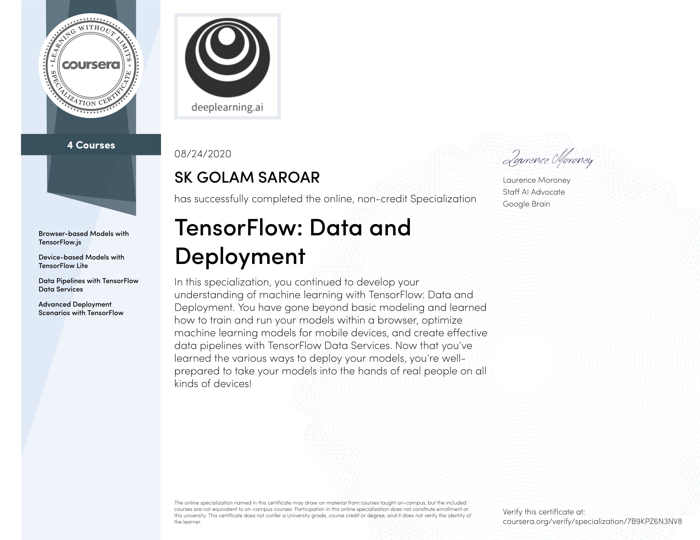

### TensorFlow: Data and Deployment Specialization on Coursera

This repository contains notebooks from the [Coursera](https://www.coursera.org/) specialization [TensorFlow: Data and Deployment](https://www.coursera.org/specializations/tensorflow-data-and-deployment).

This [TensorFlow](https://www.tensorflow.org/) specialization enables its learners to navigate through a wide range of deployment scenarios and discover new ways to use data more effectively when training their machine learning models.

There are four courses in the Specialization.

1. **Browser-based Models with TensorFlow.js**: Train and run machine learning models in any browser using TensorFlow.js. Learn techniques for handling data in the browser, and build a computer vision project that recognizes and classifies objects from a webcam.

2. **Device-based Models with TensorFlow Lite**: Learn how to run machine learning models in mobile applications. Also learn how to prepare models for a lower-powered, battery-operated devices, then execute models on both Android and iOS platforms. Finally, explore how to deploy on embedded systems using TensorFlow on Raspberry Pi and microcontrollers.

3. **Data Pipelines with TensorFlow Data Services**: Use a suite of tools in TensorFlow to more effectively leverage data and train ML model. Learn how to leverage built-in datasets with just a few lines of code, use APIs to control how to split data, and process all types of unstructured data.

4. **Advanced Deployment Scenarios with TensorFlow**: Explore four different scenarios developers encounter when deploying models- i) TensorFlow Serving, a technology that lets us do inference over the web, ii) TensorFlow Hub, a repository of models that we can use for transfer learning, iii) TensorBoard to evaluate and understand how our models work, as well as share our model metadata with others, iv) explore federated learning and how we can retrain deployed models with user data while maintaining data privacy.

This is the certificate I recieved upon completion of the Specialization.

This is the specialization description on Coursera website:

> In this four-course Specialization, you’ll learn how to get your machine learning models into the hands of real people on all kinds of devices. Start by understanding how to train and run machine learning models in browsers and in mobile applications. Learn how to leverage built-in datasets with just a few lines of code, learn about data pipelines with TensorFlow data services, use APIs to control data splitting, process all types of unstructured data and retrain deployed models with user data while maintaining data privacy. Apply your knowledge in various deployment scenarios and get introduced to TensorFlow Serving, TensorFlow, Hub, TensorBoard, and more.